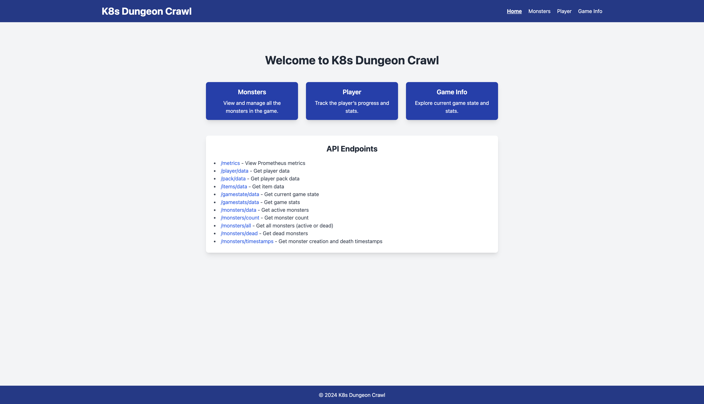
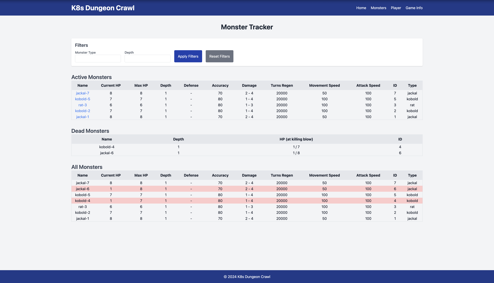
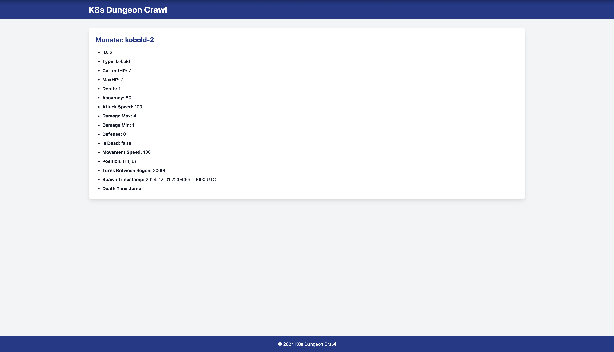
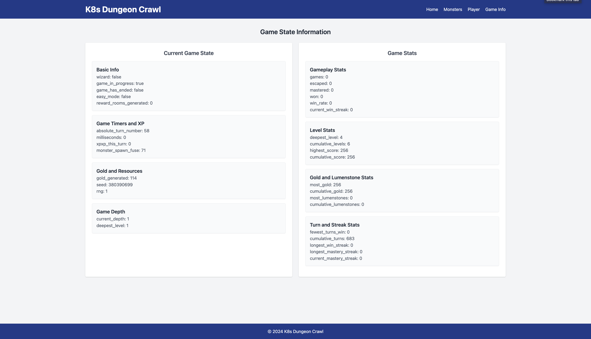

# K8s Dungeon Crawl

<div align="center">
  
</div>

https://github.com/user-attachments/assets/ae13b259-fa0b-4161-b454-37eb7a2d2faf

_Yes, you really can search the Dungeons of Doom for the Amulet of Yendor from your Grafana dashboard_

## Table of Contents
- [Introduction](#introduction)
- [Getting Started](#getting-started)
  - [Prerequisites](#prerequisites)
  - [Installation Steps](#installation-steps)
  - [Running the Project](#running-the-project)
  - [Deployment Process](#deployment-process)
- [Accessing Services](#accessing-services)
- [Architecture Overview](#architecture-overview)
- [Core Components](#core-components)
  - [The Game Server](#1-the-game-server)
  - [The Portal](#2-the-portal)
  - [Custom Resources and Controller](#3-custom-resources-and-controller)
  - [Prometheus and Grafana](#3-prometheus-and-grafana)
- [Event Flow](#event-flow)
- [Monster CRD](#monster-crd)
- [Custom Controller Logic](#custom-controller-logic)
- [Observability](#observability)
- [BrogueCE Modifications](#broguece-modifications)
- [Next Steps](#next-steps)
- [Inspiration](#inspiration)
- [Contributions](#contributions)
- [License](#license)

## Introduction

Welcome to **K8s Dungeon Crawl**, a thrilling adventure that combines the excitement of rogue-like dungeon crawling with the power of cloud-native technologies. This project is a playful experiment that bridges the worlds of gaming and Kubernetes, showing how modern infrastructure can be adapted to novel use cases. Whether you're a Kubernetes wizard or a fan of rogue-like games, this project is an entertaining way to dive deep into cloud-native technologies while fighting monsters and exploring dungeons!

At its core, K8s Dungeon Crawl uses a Kubernetes cluster to simulate and manage game elements, such as monsters and players, while integrating with tools like Grafana and Prometheus for visualization and metrics. It showcases Kubernetes custom resources, controllers, and validating and mutating webhooks.

Key features of the project:

- **Game-Oriented Custom Resources**: Monsters and other in-game elements are represented as Kubernetes resources.
- **Dynamic Event Handling**: Game events, like monster creation and destruction, trigger automated infrastructure changes.
- **Observability**: Prometheus and Grafana provide insights into the game’s state, displaying metrics such as player health, dungeon level, and monster counts.
- **Cloud-Native Tools**: Integrations with NGINX and Kubernetes controllers make this a fully cloud-native experience.
- **Modified BrogueCE Game**: The classic rouge-like dungeon crawler BrogueCE was adapted for this project. What could be better than mixing classic games with cloud-native technologies?

## Getting Started

### Prerequisites

To embark on this adventure, ensure you have the following installed:

- **Node.js**
- **Kubernetes Cluster**: Tested with `k3d`.
- **kubectl**: For Kubernetes commands
- **Docker**: For building and running container images.
- **Kubebuilder**: To manage the custom controller.

If you don't already have them set up, you can get all the details at:

- Install [Node.js](https://nodejs.org/)  
- Install [k3d](https://k3d.io/stable/#installation)
- Install [kubectl](https://kubernetes.io/docs/tasks/tools/)
- Install [Docker](https://docs.docker.com/get-started/get-docker/)
- Install [Kubebuilder](https://book.kubebuilder.io/quick-start.html#installation)

Note: I've only tested the project on an Apple Silicon Mac. Other setups may require adjustments in how you build and deploy the project.

### Installation Steps

1. Clone the repository:

   ```bash
   git clone https://github.com/schaeferka/k8s-dungeon-crawl.git
   cd k8s-dungeon-crawl
   ```

2. Ensure all scripts in the scripts folder are executable:

   ```bash
   chmod +x scripts/*.sh
   ```

3. Create an `.env` file based on the `.env-example` file:

   ```base
   cp .env-example .env
   ```

   Copying the .env-example file to create a new .env file with the default values will help ensure that the necessary environment variables are set up correctly.

4. Deploy the Kubernetes cluster and core components:

   ```bash
   npm install  # Installs dependencies
   npm run start  # Builds and deploys everything: cluster, resources, images
   ```

### Running the Project

To start the entire project, you can use the following command:

```bash
npm run start
```

This command performs the following steps:

1. Reset the Cluster: Deletes any existing cluster named k8s-dungeon-crawl and creates a new one with the same name.
2. Build and Import Images: Builds Docker images for the game, portal, and controller, and imports them into the cluster.
3. Deploy Resources: Deploys the game, portal, Grafana, Prometheus, and controller resources to the cluster.

Once the project is running, you can keep an eye on the game world through Grafana, the Portal at http://localhost:5000, and Prometheus dashboards. It’s like watching a dungeon unfold in real time… with added Kubernetes magic!

### Deployment Process

Here is a breakdown of what each script does in the deployment process:

#### _Cluster Actions_:

**scripts/cluster-action.js**

Manages the creation, deletion, starting, and stopping of the Kubernetes cluster using k3d.

#### _Namespace Actions_:

**scripts/namespace-action.js**

Handles the creation, deletion, and resetting of Kubernetes namespaces.

#### _Image Actions_:

**scripts/image-action.js**

Builds and imports Docker images for the game, portal, and controller.

#### _Deploy Resources_:

**scripts/deploy-k8s-resources.sh:** Deploys Kubernetes resources for the game, portal, Grafana, and Prometheus. Sets up needed port-forwarding.

**scripts/deploy-controller.sh**: Deploys the custom controller and its associated resources. Set up needed port-forwarding.

#### _Port-Forwarding Setup_:

The following port-forwarding configurations are set up by the scripts:

- **Controller**: Access the custom controller at [http://localhost:8080](http://localhost:8080)
  - Port-forwarding is set up by `deploy-controller.sh` or you can use:
    ```bash
    nohup kubectl port-forward deployment/${DEPLOYMENT_NAME} 8080:8080 -n ${NAMESPACE} > port-forward.log 2>&1 &
    ```
   - This is needed in order to view the monster index pages.

- **Prometheus**: Access Prometheus at [http://localhost:9090](http://localhost:9090)
  - Port-forwarding is set up by `deploy-k8s-resources.sh` or you can use:
    ```bash
    nohup kubectl port-forward deployment/prometheus-server 9090:9090 -n $NAMESPACE > prometheus-port-forward.log 2>&1 &
    ```

- **Grafana**: Access Grafana at [http://localhost:3000](http://localhost:3000)
  - Port-forwarding is set up by `deploy-k8s-resources.sh` or you can use:
    ```bash
    nohup kubectl port-forward deployment/grafana 3000:3000 -n ${NAMESPACE} > grafana-port-forward.log 2>&1 &
    ```

- **Portal Dashboard**: Access the Portal dashboard at [http://localhost:5000](http://localhost:5000)
  - Port-forwarding is set up by `deploy-k8s-resources.sh` or you can use:
    ```bash
    nohup kubectl port-forward deployment/portal 5000:5000 -n ${NAMESPACE} > portal-port-forward.log 2>&1 &
    ```

- **noVNC**: Access noVNC at [http://localhost:6080](http://localhost:6080)
  - Port-forwarding is set up by `deploy-k8s-resources.sh` or you can use:
    ```bash
    nohup kubectl port-forward deployment/novnc 6080:6080 -n ${NAMESPACE} > novnc-port-forward.log 2>&1 &
    ```
   - This allows you to play the game through your browser.

These scripts will set up the necessary port-forwarding to allow you to access the services running in your Kubernetes cluster from your local machine.

#### _Environment Loading_:

**scripts/load-env.js**
Loads environment variables from the .env file and optionally prints them.

#### _Port Checking_:

**scripts/check-ports.sh**

Checks if the required ports are available before starting the deployment.

### Accessing Services

After running npm run start, you can access the following services:

noVNC Viewer: [http://localhost:6080](http://localhost:6080)
Play BrogueCE directly in your browser (no VNC client needed!).
You may see a disconnected message when you first load the page, refreshing the page will fix this.

Grafana Dashboard: [http://localhost:3000](http://localhost:3000)
Watch your dungeon adventure metrics unfold (health, gold, monster counts, and more) as you play the game directly from the dashboard.

Prometheus UI: [http://localhost:9090](http://localhost:9090)
Dive deep into the raw metrics powering your game.

Portal Dashboard: [http://localhost:5000](http://localhost:5000)
Flask powered dashboard with a monster tracker, player details (including equipped items and pack inventory), game state, and overall game stats.

Portal Metrics: [http://localhost:5000/metrics](http://localhost:5000/metrics)
Easy access to key Portal endpoints.

## Architecture Overview


### Core Components

#### **1. The Game Server**

The Brogue game server runs inside a container, and its visual output is accessible via noVNC. Player metrics (e.g., health, dungeon level, gold count) are sent to the Portal, which processes and exposes them as metrics.

#### **2. The Portal**

The Portal serves as the central API and event processor:

- **Metrics Exporter**: Exposes game metrics (e.g., player health, monster counts) for Prometheus to scrape.
- **Event Relay**: Sends game events (e.g., monster creation/destruction) to the monster controller.

Also included are web pages to help you monitor what's happening in the game.

<div align="center">
  
  
  
</div>

<div align="center">
  
  
</div>

#### **3. Custom Resources and Controller**

The `Monster` custom resource represents monsters in the game. A Kubebuilder-based controller listens to changes in these resources and manages corresponding Kubernetes resources, such as NGINX deployments for each monster.

#### **3. Prometheus and Grafana**

- **Prometheus**: Scrapes metrics exposed by the Portal.
- **Grafana**: Visualizes game state metrics on a custom dashboard.

### Event Flow

Imagine you're playing Brogue. A kobold spawns in the game, and immediately, Kubernetes is alerted to deploy a new monster page with the kobold's details. Meanwhile, Prometheus is busy scraping the stats of your progress through the dungeon for Grafana to visualize, letting you track your progress in real time. Who says Kubernetes can't be a dungeon master?

1. **Monster Creation**:

   - The game server generates and sends a POST message to the Portal.
   - The Portal creates a CRD to represent the monster.
   - The Kubernetes controller then creates an NGINX deployment with customized content for the index page with information about the monster.

2. **Monster Destruction**:
   - When a monster is killed in the game, the Portal is notified.
   - The Portal then deletes the CRD for the monster.
   - The Monster controller then deletes the corresponding NGINX deployment.

### Event Flow Diagram


### Monster CRD

```yaml
apiVersion: kaschaefer.com/v1
kind: Monster
metadata:
  name: goblin
spec:
  accuracy: 80
  attack-speed: 100
  damage_max: 4
  damage_min: 1
  death_timestamp: ""
  defense: 0
  depth: 2
  hp: 8
  id: 4
  is_dead: False
  max_hp: 8
  movement_speed: 40
  name: goblin-4
  position:
    x: 45
    y: 120
  spawn_timestamp: "Fri, 29 Nov 2024 21:40:12 GMT"
  turns_between_regen: 20000
  type: goblin
```

The Monster CRD defines the schema for monsters, including their type, health, attack, defense, speed, and abilities.

### Custom Controller Logic

The controller:

- Watches the `Monster` CRD for changes.
- Creates or deletes NGINX deployments based on monster events.
- Generates ConfigMaps for NGINX `index.html` files, displaying monster-specific information. These pages can be easily accessed from the Monsters page of the Portal Dashboard at [http://localhost:5000/monsters](https://localhost:5000/monsters)

## Observability

Observe your dungeon in real time with Prometheus and Grafana. Watch your player’s health fluctuate and see the dungeon’s monster population grow. It’s like having a dungeon map with live updates.

#### Grafana Dashboard

- Player information such as health and gold are displayed as live metrics.
- Dungeon level and monster counts are updated in real-time.
- Cluster metrics are displayed.
- A noVNC panel allows direct interaction with the game. Yes, you really can play Brogue from your Grafana dashboard!

The default login information is:

username: admin
password: pass

Please don't use these in a production environment.

#### Prometheus Metrics

The Portal exposes metrics in the following format:

```bash
  # HELP brogue_player_gold Amount of gold collected by the player
   # TYPE brogue_player_gold gauge
   brogue_player_gold 247.0
   # HELP brogue_depth_level Current depth level of the player
   # TYPE brogue_depth_level gauge
   brogue_depth_level 5.0
   # HELP brogue_deepest_level Deepest level reached by the player
   # TYPE brogue_deepest_level gauge
   brogue_deepest_level 7.0
   # HELP brogue_player_current_hp Current hit points of the player
   # TYPE brogue_player_current_hp gauge
   brogue_player_current_hp 23.0
   # HELP brogue_player_max_hp Maximum hit points of the player
   # TYPE brogue_player_max_hp gauge
   brogue_player_max_hp 30.0
   # HELP brogue_strength Player’s strength
   # TYPE brogue_strength gauge
   brogue_strength 13.0
   # HELP brogue_stealth_range Distance from which monsters will notice the player
   # TYPE brogue_stealth_range gauge
   brogue_stealth_range 8.0
   # HELP brogue_player_turns Total turns played by the player
   # TYPE brogue_player_turns gauge
   brogue_player_turns 435.0

  /// And many more metrics...
```

Prometheus scrapes this endpoint and makes the metrics available for Grafana.

## BrogueCE Modifications

This project wouldn't be possible without the amazing [BrogueCE](https://github.com/tmewett/BrogueCE) game. Most of the modifications I made can be found in the [`./game/src/portal`](./game/src/portal/) folder with minor changes in other sections as needed to get everything up and running.

## Next Steps

- [ ] Implement deleting monster in game if monster deployment is deleted in the cluster by some means other than the monster being killed in the game (because even monsters deserve a peaceful exit).
- [ ] Implement creating monsters based on pods in "monstie" namespace (because randomly destroying real pods in your cluster is always fun).
- [ ] Implement player bonuses based on killing monsties (because stat bonuses are always good).
- [x] Add architecture diagram (because understanding the dungeon’s structure is key to slaying the monsters).
- [x] Add event flow diagram (because even the dungeon’s chaos needs a bit of order).
- [ ] Implement persistent storage (because the Dungeon of Doom shouldn't just disappear).
- [ ] Add more detailed metrics for player actions (because everyone needs something to brag about to their gamer friends).
- [ ] Improve the Grafana dashboard with more visualizations (because who wouldn't want to see more metrics).
- [ ] Write more unit tests for the custom controller (because testing is fun).
- [ ] Document the API endpoints in detail (because no one likes to hunt through source code to figure these things out).
- [ ] Create Helm chart (because Kubernetes isn’t scary, it’s just a little bit of YAML).
- [ ] Add mutating and validating webhooks (because such magic belongs in the Dungeon of Doom).
- [ ] Test deploying on AWS, Azure, and Google Cloud (because the Dungeon of Doom deserves to exist in the cloud and not just on your dev machine).

## Inspiration

Lately I've been spending a lot of time working with Kubernetes and cloud-native technologies. Along the way, I ran into [KubeDoom](https://github.com/storax/kubedoom) which inspired me to find a fun way to explore Kubernetes and cloud-native technologies. Being able to have fun with CRDs, controllers, and validating and mutating webhooks is an added bonus. One thing led to another and the result is K8s Dungeon Crawl.

## Contributions

I'm always happy to have adventurers join my quest! If you’ve got ideas for expanding the game, fixing bugs, or just making things more epic, feel free to open an issue or submit a pull request. No experience with Kubernetes? No problem. Let’s tackle this dungeon together!

## License

This project is licensed under the Apache License 2.0. See the LICENSE file for details.

---

# Let the dungeon crawl begin!
