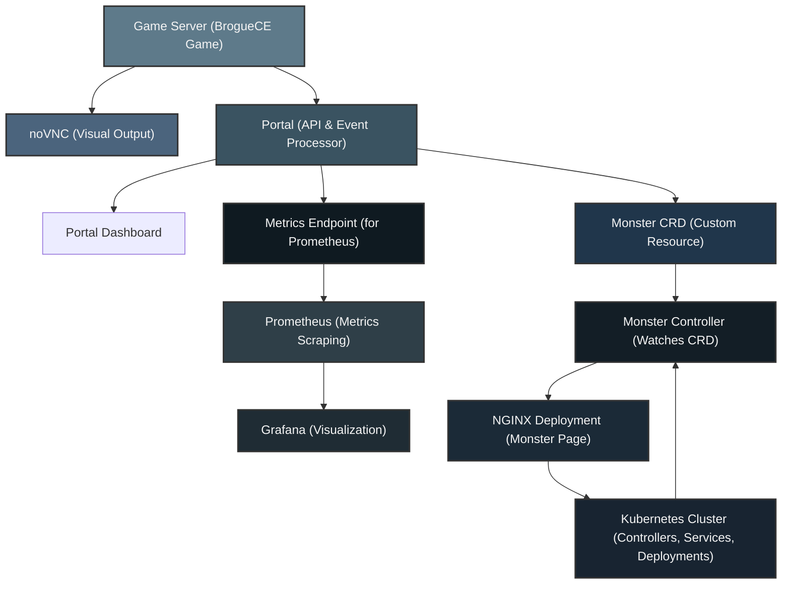

```mermaid
graph TD
    A["`Game Server (BrogueCE Game)`"] --> B["`noVNC (Visual Output)`"]
    A --> C["`Portal (API & Event Processor)`"]
    D --> E["`Grafana (Visualization)`"]
    C --> K["`Portal Dashboard`"]
    C --> F["`Monster CRD (Custom Resource)`"]
    G --> H["`Kubernetes Cluster (Controllers, Services, Deployments)`"]
    H --> I["`Monster Controller (Watches CRD)`"]
    I --> G["`NGINX Deployment (Monster Page)`"]
    F --> I
    C --> J["`Metrics Endpoint (for Prometheus)`"]
    J --> D["`Prometheus (Metrics Scraping)`"]

    style A fill:#5e7a8a,stroke:#333,stroke-width:2px, color:#f4f4f4
    style B fill:#4b647d,stroke:#333,stroke-width:2px, color:#f4f4f4
    style C fill:#3a5361,stroke:#333,stroke-width:2px, color:#f4f4f4
    style D fill:#2f3f48,stroke:#333,stroke-width:2px, color:#f4f4f4
    style E fill:#1f2c34,stroke:#333,stroke-width:2px, color:#f4f4f4
    style F fill:#20364b,stroke:#333,stroke-width:2px, color:#f4f4f4
    style G fill:#1b2a37,stroke:#333,stroke-width:2px, color:#f4f4f4
    style H fill:#182431,stroke:#333,stroke-width:2px, color:#f4f4f4
    style I fill:#131e26,stroke:#333,stroke-width:2px, color:#f4f4f4
    style J fill:#0f1a21,stroke:#333,stroke-width:2px, color:#f4f4f4
```