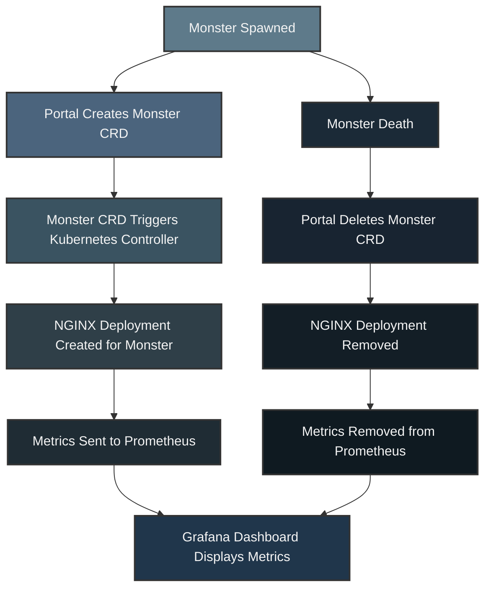

```mermaid
graph TD
    A["`Monster Spawned`"] --> B["`Portal Creates Monster CRD`"]
    B --> C["`Monster CRD Triggers Kubernetes Controller`"]
    C --> D["`NGINX Deployment Created for Monster`"]
    D --> E["`Metrics Sent to Prometheus`"]
    E --> F["`Grafana Dashboard Displays Metrics`"]
    A --> G["`Monster Death`"]
    G --> H["`Portal Deletes Monster CRD`"]
    H --> I["`NGINX Deployment Removed`"]
    I --> J["`Metrics Removed from Prometheus`"]
    J --> F

    style A fill:#5e7a8a,stroke:#333,stroke-width:2px, color:#f4f4f4
    style B fill:#4b647d,stroke:#333,stroke-width:2px, color:#f4f4f4
    style C fill:#3a5361,stroke:#333,stroke-width:2px, color:#f4f4f4
    style D fill:#2f3f48,stroke:#333,stroke-width:2px, color:#f4f4f4
    style E fill:#1f2c34,stroke:#333,stroke-width:2px, color:#f4f4f4
    style F fill:#20364b,stroke:#333,stroke-width:2px, color:#f4f4f4
    style G fill:#1b2a37,stroke:#333,stroke-width:2px, color:#f4f4f4
    style H fill:#182431,stroke:#333,stroke-width:2px, color:#f4f4f4
    style I fill:#131e26,stroke:#333,stroke-width:2px, color:#f4f4f4
    style J fill:#0f1a21,stroke:#333,stroke-width:2px, color:#f4f4f4
```